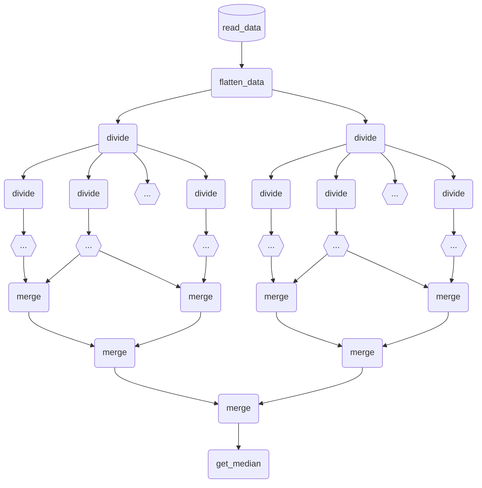

<strong> Universidade de São Paulo - ICMC - BCC

SSC0903 - Computação de Alto Desempenho (2022/2)

Primeiro Trabalho Prático (TB1) - Resolução em Grupo

Turma: A

Número do Grupo: 01

Nomes dos integrantes deste grupo que resolveram o trabalho: </strong>

Karoliny Oliveira Ozias Silva

<u><strong> Resposta para Q01: </strong></u>

# Introdução

O problema em análise consiste em um vetor tridimensional, em que suas três dimensões representam, respectivamente, a região do país, a cidade da região e a nota do estudante dessa cidade. Assim sendo, foram solicitados os seguintes itens referentes a esses dados: os valores mínimo, máximo e médio, além da mediana e do desvio padrão, em que cada um deles pode ser calculado para uma cidade, para uma região e, finalmente, para todo o país -- neste caso tratando todos os dados conjuntamente. Logo, considerando-se o requisito de projeto de paralelização do problema, foram implementadas duas variantes para sua resolução -- sendo uma delas sequencial e, a outra, paralela por meio do uso da API OpenMP para a linguagem de programação C; os tempos de resposta de ambas as versões serão utilizadas posteriormente para cômputo de ganhos de eficiência da paralelização sobre a execução sequencial.

# Análise PCAM

A fim de se propor um projeto de paralelização, a análise PCAM será utilizada -- sendo ela referente às técnicas de Particionamento, Comunicação, Aglomeração e Mapeamento. Desse modo, uma análise será feita individualmente para cada um dos requisitos apresentados, sendo que o Mapeamento considerará, em todo caso, a execução realizada em um *cluster* contendo XXX processadores homogêneos, além de que, na Aglomeração, como tal, será sempre considerado uma máquina MIMD com mémoria compartilhada. Portanto, o Mapeamento dividirá, de maneira estática, os aglomerados obtidos ao longo dos processadores do sistema computacional -- utilizando, para tanto, uma fila circular; essa configuração será constante ao longo dos tópicos e, dessa forma, será otimida nas seções seguintes.

## Mínimo

### Particionamento
Para o Particionamento do problema do valor mínimo, considere o grafo abaixo e tome $h\in\{1,2,...,11\}$ como a profundidade corrente na árvore, em que paralelização a nível de tarefas pode ser realizado nas profundidades intermediárias. Assim sendo, após a obtenção dos dados e a sua formatação em um vetor tridimensional, realiza-se particionamento por dados -- dividindo o problema em regiões, atribuindo cada uma delas a uma tarefa. Em seguida, faz-se particionamento por cidades para cada região e, para cada cidade, particiona-se em estudantes. Por fim, faz-se redução por minimização dois a dois, isto é, a cada par de estudantes, toma-se a menor nota dentre as duas tarefas, eventualmente tomando mínimos entre cidades e entre regiões. Logo, em $h=7$, produz-se  o valor mínimo da cidade; em $h=9$, o da região; em $h=11$, o do país.

```mermaid
%% Paralelização do problema de minimização

%% Tipo de grafo
graph TD 

%% Regiões
id1[(read_data)] --> region_1
id1[(read_data)] --> region_2
id1[(read_data)] --> id2{{...}}
id1[(read_data)] --> region_R

%% Cidades :: região 1
region_1 --> city_11
region_1 --> city_12
region_1 --> id3{{...}}
region_1 --> city_1C

%% Cidades :: região 2
region_2 --> city_21
region_2 --> city_22
region_2 --> id4{{...}}
region_2 --> city_2C

%% Cidades :: região R
region_R --> city_R1
region_R --> city_R2
region_R --> id5{{...}}
region_R --> city_RC

%% Alunos :: região 1 :: cidade 1
city_11 --> student_111
city_11 --> student_112
city_11 --> id6{{...}}
city_11 --> student_11A

%% Alunos :: região 1 :: cidade 2
city_12 --> student_121
city_12 --> student_122
city_12 --> id7{{...}}
city_12 --> student_12A

%% Alunos :: região 1 :: cidade C
city_1C --> student_1C1
city_1C --> student_1C2
city_1C --> id8{{...}}
city_1C --> student_1CA

%% Alunos :: região 2 :: cidades
city_21 --> id9{{...}}
city_22 --> id10{{...}}
city_2C --> id11{{...}}

%% Alunos :: região R :: cidades
city_R1 --> id12{{...}}
city_R2 --> id13{{...}}
city_RC --> id14{{...}}

%% Redução :: região 1 :: cidade 1
student_111 --> id15((min))
student_112 --> id15((min))
student_112 --> id16((min))
id6{{...}} --> id16((min))
id6{{...}} --> id17((min))
student_11A --> id17((min))
id15((min)) --> id24((min))
id16((min)) --> id24((min))
id16((min)) --> id25((min))
id17((min)) --> id25((min))
id24((min)) --> id26((min)) %% ...
id25((min)) --> id26((min)) %% Redução da cidade 1

%% Redução :: região 1 :: cidade 2
student_121 --> id18((min))
student_122 --> id18((min))
student_122 --> id19((min))
id7{{...}} --> id19((min))
id7{{...}} --> id20((min))
student_12A --> id20((min))
id18((min)) --> id27((min))
id19((min)) --> id27((min))
id19((min)) --> id28((min))
id20((min)) --> id28((min))
id27((min)) --> id29((min)) %% ...
id28((min)) --> id29((min)) %% Redução da cidade 2

%% Redução :: região 1 :: cidade C
student_1C1 --> id21((min))
student_1C2 --> id21((min))
student_1C2 --> id22((min))
id8{{...}} --> id22((min))
id8{{...}} --> id23((min))
student_1CA --> id23((min))
id21((min)) --> id30((min))
id22((min)) --> id30((min))
id22((min)) --> id31((min))
id23((min)) --> id31((min))
id30((min)) --> id32((min)) %% ...
id31((min)) --> id32((min)) %% Redução da cidade C

%% Redução da região 1
id26((min)) --> id33((min))
id29((min)) --> id33((min))
id29((min)) --> id34((min))
id32((min)) --> id34((min))
id33((min)) --> id35((min)) %% ...
id34((min)) --> id35((min)) %% Redução da Região 1

%% Redução da região 2
id9{{...}} --> id36((min))
id10{{...}} --> id36((min))
id10{{...}} --> id37((min))
id4{{...}} --> id37((min))
id4{{...}} --> id38((min))
id11{{...}} --> id38((min))
id36((min)) --> id42((min))
id37((min)) --> id42((min))
id37((min)) --> id43((min))
id38((min)) --> id43((min))
id42((min)) --> id44((min)) %% ...
id43((min)) --> id44((min)) %% Redução da região 2

%% Redução da região R
id12{{...}} --> id39((min))
id13{{...}} --> id39((min))
id13{{...}} --> id40((min))
id5{{...}} --> id40((min))
id5{{...}} --> id41((min))
id14{{...}} --> id41((min))
id39((min)) --> id45((min))
id40((min)) --> id45((min))
id40((min)) --> id46((min))
id41((min)) --> id46((min))
id45((min)) --> id47((min)) %% ...
id46((min)) --> id47((min)) %% Redução da região R

%% Redução do país
id35((min)) --> id48((min))
id44((min)) --> id48((min))
id44((min)) --> id49((min))
id47((min)) --> id49((min))
id48((min)) --> id50((min)) %% ...
id49((min)) --> id50((min)) %% Redução do país
```
### Comunicação
Para a Comunicação neste problema, o fluxo de dados segue o grafo de dependências das tarefas. Os dados obtidos pela tarefa inicial são transmitidos às tarefas de obtenção de mínimos por região, cada qual transmite seus dados para as respectivas tarefas de obtenção de mínimos por cidade que, por sua vez, transmitem os dados para as tarefas atômicas de obtenção de mínimos por estudante -- as quais retornam a nota dele em si. A partir daí, a comunicação ocorre em pares em níveis equivalentes da árvore, até que se obtenha o mínimo buscado -- seja ele por cidade, por região ou por país, bastando tomar o subgrafo correspondente para cômputo.

### Aglomeração
Em geral, são criados tantos processos quantos elementos de processamento disponíveis no sistema computacional em questão. Todavia, a tarefa inicial é atribuída a um único processo -- tal como a tarefa final, que retornará o mínimo buscado. Daí, caso seja buscado o mínimo da cidade, da região ou do país, respectivamente, será criado um *pool* de tarefas para cada par de estudante, cada cidade ou cada região -- o qual será consumido pelos processos criados anteriormente. Em geral, não haverá regiões críticas entre processos.

## Máximo

A análise PCAM, para a obtenção de máximos locais ou globais, é inteiramente semelhante àquela feita para o valor mínimo, sendo a única diferença a substituição da redução de minimização por uma redução de maximização -- isto é, a cada par de tarefas, recuperar sempre o maior valor armazenado entre as duas.

## Média

### Particionamento

Realiza-se, aqui, particionamento por dados significativamente semelhante àquele realizado nos dois itens anteriores, em que se substitui a redução por minimização/maximização por uma redução de soma. Entretanto, nos níveis $h=7$, $h=9$ e $h=11$, ao invés de apenas reduzir por soma binária, faz-se também uma divisão por A, por C e por R respectivamente -- de modo a retornar as médias da cidade, da região e do país nessas etapas.

```mermaid
%% Paralelização do problema de média aritmética simples

%% Tipo de grafo
graph TD 

%% Regiões
id1[(read_data)] --> region_1
id1[(read_data)] --> region_2
id1[(read_data)] --> id2{{...}}
id1[(read_data)] --> region_R

%% Cidades :: região 1
region_1 --> city_11
region_1 --> city_12
region_1 --> id3{{...}}
region_1 --> city_1C

%% Cidades :: região 2
region_2 --> city_21
region_2 --> city_22
region_2 --> id4{{...}}
region_2 --> city_2C

%% Cidades :: região R
region_R --> city_R1
region_R --> city_R2
region_R --> id5{{...}}
region_R --> city_RC

%% Alunos :: região 1 :: cidade 1
city_11 --> student_111
city_11 --> student_112
city_11 --> id6{{...}}
city_11 --> student_11A

%% Alunos :: região 1 :: cidade 2
city_12 --> student_121
city_12 --> student_122
city_12 --> id7{{...}}
city_12 --> student_12A

%% Alunos :: região 1 :: cidade C
city_1C --> student_1C1
city_1C --> student_1C2
city_1C --> id8{{...}}
city_1C --> student_1CA

%% Alunos :: região 2 :: cidades
city_21 --> id9{{...}}
city_22 --> id10{{...}}
city_2C --> id11{{...}}

%% Alunos :: região R :: cidades
city_R1 --> id12{{...}}
city_R2 --> id13{{...}}
city_RC --> id14{{...}}

%% Redução :: região 1 :: cidade 1
student_111 --> id15((sum))
student_112 --> id15((sum))
student_112 --> id16((sum))
id6{{...}} --> id16((sum))
id6{{...}} --> id17((sum))
student_11A --> id17((sum))
id15((sum)) --> id24((sum))
id16((sum)) --> id24((sum))
id16((sum)) --> id25((sum))
id17((sum)) --> id25((sum))
id24((sum)) --> id26(mean) %% ...
id25((sum)) --> id26(mean) %% Redução da cidade 1

%% Redução :: região 1 :: cidade 2
student_121 --> id18((sum))
student_122 --> id18((sum))
student_122 --> id19((sum))
id7{{...}} --> id19((sum))
id7{{...}} --> id20((sum))
student_12A --> id20((sum))
id18((sum)) --> id27((sum))
id19((sum)) --> id27((sum))
id19((sum)) --> id28((sum))
id20((sum)) --> id28((sum))
id27((sum)) --> id29(mean) %% ...
id28((sum)) --> id29(mean) %% Redução da cidade 2

%% Redução :: região 1 :: cidade C
student_1C1 --> id21((sum))
student_1C2 --> id21((sum))
student_1C2 --> id22((sum))
id8{{...}} --> id22((sum))
id8{{...}} --> id23((sum))
student_1CA --> id23((sum))
id21((sum)) --> id30((sum))
id22((sum)) --> id30((sum))
id22((sum)) --> id31((sum))
id23((sum)) --> id31((sum))
id30((sum)) --> id32(mean) %% ...
id31((sum)) --> id32(mean) %% Redução da cidade C

%% Redução da região 1
id26(mean) --> id33((sum))
id29(mean) --> id33((sum))
id29(mean) --> id34((sum))
id32(mean) --> id34((sum))
id33((sum)) --> id35(mean) %% ...
id34((sum)) --> id35(mean) %% Redução da Região 1

%% Redução da região 2
id9{{...}} --> id36((sum))
id10{{...}} --> id36((sum))
id10{{...}} --> id37((sum))
id4{{...}} --> id37((sum))
id4{{...}} --> id38((sum))
id11{{...}} --> id38((sum))
id36((sum)) --> id42((sum))
id37((sum)) --> id42((sum))
id37((sum)) --> id43((sum))
id38((sum)) --> id43((sum))
id42((sum)) --> id44(mean) %% ...
id43((sum)) --> id44(mean) %% Redução da região 2

%% Redução da região R
id12{{...}} --> id39((sum))
id13{{...}} --> id39((sum))
id13{{...}} --> id40((sum))
id5{{...}} --> id40((sum))
id5{{...}} --> id41((sum))
id14{{...}} --> id41((sum))
id39((sum)) --> id45((sum))
id40((sum)) --> id45((sum))
id40((sum)) --> id46((sum))
id41((sum)) --> id46((sum))
id45((sum)) --> id47(mean) %% ...
id46((sum)) --> id47(mean) %% Redução da região R

%% Redução do país
id35(mean) --> id48((sum))
id44(mean) --> id48((sum))
id44(mean) --> id49((sum))
id47(mean) --> id49((sum))
id48((sum)) --> id50(mean) %% ...
id49((sum)) --> id50(mean) %% Redução do país
```
### Comunicação

De forma análoga ao problema de minimazação/maximização, a comunicação segue o fluxo do grafo de dependências das tarefas; horizontalmente, a comunicação é binária entre tarefas; verticalmente, os dados de um escopo maior dos dados, como cidade ou região, é distribuída entre as tarefas do próximo nível.

### Aglomeração

Também semelhante à dos problemas anteriores; não há regiões críticas entre processos.

## Desvio Padrão (DP)

Para este problema, a Comunicação e a Aglomeração são análogas às dos itens anteriores, porém o Particionamento varia de acordo com o escopo buscado. Porém, em termos gerais, a média de interesse deve sempre ser calculada após a aquisição dos dados, e o estudante sempre terá, em cada tarefa responsável por tratar seus dados, sua nota subtraída pela média do escopo e, o seu resultado, tomado ao quadrado.

### Particionamento para o DP de uma cidade

Após reduzir por soma todas as notas de todos os estudantes da cidade, uma única tarefa será responsável por calcular a média desse resultado, isto é, dividí-lo por $A$ e depois tomar a raiz quadrada do resultado.

```mermaid
%% Paralelização do problema do desvio padrão

%% Tipo de grafo
graph TD 

%% Regiões
id1[(read_data)] --> id0(get_city_mean)
id1[(read_data)] --> idA(select_city_data)

%% Alunos :: região 1 :: cidade 1
id0(get_city_mean) --> id52("pow(student_1 - city_mean, 2)")
id0(get_city_mean) --> id53("pow(student_2 - city_mean, 2)")
id0(get_city_mean) --> id6{{...}}
id0(get_city_mean) --> id54("pow(student_A - city_mean, 2)")

idA(select_city_data) --> id52("pow(student_1 - city_mean, 2)")
idA(select_city_data) --> id53("pow(student_2 - city_mean, 2)")
idA(select_city_data) --> id6{{...}}
idA(select_city_data) --> id54("pow(student_A - city_mean, 2)")

%% Redução :: região 1 :: cidade 1
id52("pow(student_1 - city_mean, 2)") --> id15((sum))
id53("pow(student_2 - city_mean, 2)") --> id15((sum))
id53("pow(student_2 - city_mean, 2)") --> id16((sum))
id6{{...}} --> id16((sum))
id6{{...}} --> id17((sum))
id54("pow(student_A - city_mean, 2)") --> id17((sum))
id15((sum)) --> id24((sum))
id16((sum)) --> id24((sum))
id16((sum)) --> id25((sum))
id17((sum)) --> id25((sum))
id24((sum)) --> id26((sum)) %% ...
id25((sum)) --> id26((sum)) %% Redução da cidade 1
id26((sum)) --> id27(squared_root_mean) %% DP da cidade
```

### Particionamento para o DP de uma região

Após reduzir por soma todas as notas de todos os estudantes da região, uma única tarefa será responsável por calcular a média desse resultado, isto é, dividí-lo por $C \cdot A$ e depois tomar a raiz quadrada do resultado.

```mermaid
%% Paralelização do problema do desvio padrão

%% Tipo de grafo
graph TD 

%% Regiões
id1[(read_data)] --> id0(get_region_mean)
id1[(read_data)] --> idA(select_region_data)

%% Cidades :: região 1
id0(get_region_mean) --> city_11
id0(get_region_mean) --> city_12
id0(get_region_mean) --> id3{{...}}
id0(get_region_mean) --> city_1C

idA(select_region_data) --> city_11
idA(select_region_data) --> city_12
idA(select_region_data) --> id3{{...}}
idA(select_region_data) --> city_1C

%% Alunos :: região 1 :: cidade 1
city_11 --> id52("pow(student_11 - region_mean, 2)")
city_11 --> id53("pow(student_12 - region_mean, 2)")
city_11 --> id6{{...}}
city_11 --> id54("pow(student_1A - region_mean, 2)")

%% Alunos :: região 1 :: cidade 2
city_12 --> id55("pow(student_21 - region_mean, 2)")
city_12 --> id56("pow(student_22 - region_mean, 2)")
city_12 --> id7{{...}}
city_12 --> id57("pow(student_2A - region_mean, 2)")

%% Alunos :: região 1 :: cidade C
city_1C --> id58("pow(student_C1 - region_mean, 2)")
city_1C --> id59("pow(student_C2 - region_mean, 2)")
city_1C --> id8{{...}}
city_1C --> id60("pow(student_CA - region_mean, 2)")

%% Redução :: região 1 :: cidade 1
id52("pow(student_11 - region_mean, 2)") --> id15((sum))
id53("pow(student_12 - region_mean, 2)") --> id15((sum))
id53("pow(student_12 - region_mean, 2)") --> id16((sum))
id6{{...}} --> id16((sum))
id6{{...}} --> id17((sum))
id54("pow(student_1A - region_mean, 2)") --> id17((sum))
id15((sum)) --> id24((sum))
id16((sum)) --> id24((sum))
id16((sum)) --> id25((sum))
id17((sum)) --> id25((sum))
id24((sum)) --> id26((sum)) %% ...
id25((sum)) --> id26((sum)) %% Redução da cidade 1

%% Redução :: região 1 :: cidade 2
id55("pow(student_21 - region_mean, 2)") --> id18((sum))
id56("pow(student_22 - region_mean, 2)") --> id18((sum))
id56("pow(student_22 - region_mean, 2)") --> id19((sum))
id7{{...}} --> id19((sum))
id7{{...}} --> id20((sum))
id57("pow(student_2A - region_mean, 2)") --> id20((sum))
id18((sum)) --> id27((sum))
id19((sum)) --> id27((sum))
id19((sum)) --> id28((sum))
id20((sum)) --> id28((sum))
id27((sum)) --> id29((sum)) %% ...
id28((sum)) --> id29((sum)) %% Redução da cidade 2

%% Redução :: região 1 :: cidade C
id58("pow(student_C1 - region_mean, 2)") --> id21((sum))
id59("pow(student_C2 - region_mean, 2)") --> id21((sum))
id59("pow(student_C2 - region_mean, 2)") --> id22((sum))
id8{{...}} --> id22((sum))
id8{{...}} --> id23((sum))
id60("pow(student_CA - region_mean, 2)") --> id23((sum))
id21((sum)) --> id30((sum))
id22((sum)) --> id30((sum))
id22((sum)) --> id31((sum))
id23((sum)) --> id31((sum))
id30((sum)) --> id32((sum)) %% ...
id31((sum)) --> id32((sum)) %% Redução da cidade C

%% Redução da região 1
id26((sum)) --> id33((sum))
id29((sum)) --> id33((sum))
id29((sum)) --> id34((sum))
id32((sum)) --> id34((sum))
id33((sum)) --> id35((sum)) %% ...
id34((sum)) --> id35((sum)) %% Redução da Região 1
id35((sum)) --> id36(squared_root_mean) %% DP da região
```

### Particionamento para o DP do país

Após reduzir por soma todas as notas de todos os estudantes do país, uma única tarefa será responsável por calcular a média desse resultado, isto é, dividí-lo por $R \cdot C \cdot A$ e depois tomar a raiz quadrada do resultado.

```mermaid
%% Paralelização do problema do desvio padrão

%% Tipo de grafo
graph TD 

%% Regiões
id1[(read_data)] --> id0(get_country_mean)
id1[(read_data)] --> idA(select_country_data)

idA(select_country_data) --> region_1
idA(select_country_data) --> region_2
idA(select_country_data) --> id2{{...}}
idA(select_country_data) --> region_R

id0(get_country_mean) --> region_1
id0(get_country_mean) --> region_2
id0(get_country_mean) --> id2{{...}}
id0(get_country_mean) --> region_R

%% Cidades :: região 1
region_1 --> city_11
region_1 --> city_12
region_1 --> id3{{...}}
region_1 --> city_1C

%% Cidades :: região 2
region_2 --> city_21
region_2 --> city_22
region_2 --> id4{{...}}
region_2 --> city_2C

%% Cidades :: região R
region_R --> city_R1
region_R --> city_R2
region_R --> id5{{...}}
region_R --> city_RC

%% Alunos :: região 1 :: cidade 1
city_11 --> id52("pow(student_111 - country_mean, 2)")
city_11 --> id53("pow(student_112 - country_mean, 2)")
city_11 --> id6{{...}}
city_11 --> id54("pow(student_11A - country_mean, 2)")

%% Alunos :: região 1 :: cidade 2
city_12 --> id55("pow(student_121 - country_mean, 2)")
city_12 --> id56("pow(student_122 - country_mean, 2)")
city_12 --> id7{{...}}
city_12 --> id57("pow(student_12A - country_mean, 2)")

%% Alunos :: região 1 :: cidade C
city_1C --> id58("pow(student_1C1 - country_mean, 2)")
city_1C --> id59("pow(student_1C2 - country_mean, 2)")
city_1C --> id8{{...}}
city_1C --> id60("pow(student_1CA - country_mean, 2)")

%% Alunos :: região 2 :: cidades
city_21 --> id9{{...}}
city_22 --> id10{{...}}
city_2C --> id11{{...}}

%% Alunos :: região R :: cidades
city_R1 --> id12{{...}}
city_R2 --> id13{{...}}
city_RC --> id14{{...}}

%% Redução :: região 1 :: cidade 1
id52("pow(student_111 - country_mean, 2)") --> id15((sum))
id53("pow(student_112 - country_mean, 2)") --> id15((sum))
id53("pow(student_112 - country_mean, 2)") --> id16((sum))
id6{{...}} --> id16((sum))
id6{{...}} --> id17((sum))
id54("pow(student_11A - country_mean, 2)") --> id17((sum))
id15((sum)) --> id24((sum))
id16((sum)) --> id24((sum))
id16((sum)) --> id25((sum))
id17((sum)) --> id25((sum))
id24((sum)) --> id26((sum)) %% ...
id25((sum)) --> id26((sum)) %% Redução da cidade 1

%% Redução :: região 1 :: cidade 2
id55("pow(student_121 - country_mean, 2)") --> id18((sum))
id56("pow(student_122 - country_mean, 2)") --> id18((sum))
id56("pow(student_122 - country_mean, 2)") --> id19((sum))
id7{{...}} --> id19((sum))
id7{{...}} --> id20((sum))
id57("pow(student_12A - country_mean, 2)") --> id20((sum))
id18((sum)) --> id27((sum))
id19((sum)) --> id27((sum))
id19((sum)) --> id28((sum))
id20((sum)) --> id28((sum))
id27((sum)) --> id29((sum)) %% ...
id28((sum)) --> id29((sum)) %% Redução da cidade 2

%% Redução :: região 1 :: cidade C
id58("pow(student_1C1 - country_mean, 2)") --> id21((sum))
id59("pow(student_1C2 - country_mean, 2)") --> id21((sum))
id59("pow(student_1C2 - country_mean, 2)") --> id22((sum))
id8{{...}} --> id22((sum))
id8{{...}} --> id23((sum))
id60("pow(student_1CA - country_mean, 2)") --> id23((sum))
id21((sum)) --> id30((sum))
id22((sum)) --> id30((sum))
id22((sum)) --> id31((sum))
id23((sum)) --> id31((sum))
id30((sum)) --> id32((sum)) %% ...
id31((sum)) --> id32((sum)) %% Redução da cidade C

%% Redução da região 1
id26((sum)) --> id33((sum))
id29((sum)) --> id33((sum))
id29((sum)) --> id34((sum))
id32((sum)) --> id34((sum))
id33((sum)) --> id35((sum)) %% ...
id34((sum)) --> id35((sum)) %% Redução da Região 1

%% Redução da região 2
id9{{...}} --> id36((sum))
id10{{...}} --> id36((sum))
id10{{...}} --> id37((sum))
id4{{...}} --> id37((sum))
id4{{...}} --> id38((sum))
id11{{...}} --> id38((sum))
id36((sum)) --> id42((sum))
id37((sum)) --> id42((sum))
id37((sum)) --> id43((sum))
id38((sum)) --> id43((sum))
id42((sum)) --> id44((sum)) %% ...
id43((sum)) --> id44((sum)) %% Redução da região 2

%% Redução da região R
id12{{...}} --> id39((sum))
id13{{...}} --> id39((sum))
id13{{...}} --> id40((sum))
id5{{...}} --> id40((sum))
id5{{...}} --> id41((sum))
id14{{...}} --> id41((sum))
id39((sum)) --> id45((sum))
id40((sum)) --> id45((sum))
id40((sum)) --> id46((sum))
id41((sum)) --> id46((sum))
id45((sum)) --> id47((sum)) %% ...
id46((sum)) --> id47((sum)) %% Redução da região R

%% Redução do país
id35((sum)) --> id48((sum))
id44((sum)) --> id48((sum))
id44((sum)) --> id49((sum))
id47((sum)) --> id49((sum))
id48((sum)) --> id50((sum)) %% ...
id49((sum)) --> id50((sum)) %% Redução do país
id50((sum)) --> id51(squared_root_mean) %% DP do país
```

## Mediana

Para o problema da mediana, será utilizado o algoritmo de ordenação *merge sort*, que possui um paradigma de divisão e conquista. Desse modo, ao final da ordenação, basta recuperar a região central do vetor a fim de se obter a mediana, sendo esta ou o próprio elemento central -- caso o vetor tenha comprimento ímpar --, ou a média aritmética dos dois elementos centrais -- caso contrário. Para tanto, considere o seguinte pseudocódigo:

```
mergesort(array):
-----------------
len = length(array)
if len <= 1:
	return array
in parallel do:
	left = mergesort(array[0...len/2])
	right = mergesort(array[len/2...len])
return merge(left, right)
```

### Particionamento

Após leitura dos dados, as notas dos estudantes devem ser inseridas em um arranjo unidimensional para fins de ordenação. Daí, faz-se particionamento por dados, dividindo secções do arranjo a diferentes tarefas até que o comprimento do arranjo recebido seja atômico. Após esse momento, realiza-se mesclagem binária entre as seções até que se obtenha todo o arranjo original ordenado.



### Comunicação

Para este problema, a comunicação segue o fluxo de dados do grafo de dependências das tarefas. Em geral, a comunicação entre tarefas ocorre nas fases de mesclagem, porém essa sempre é realizada por apenas uma tarefa e, como tal, não há regiões críticas a serem consideradas. Além disso, como cada tarefa recebe uma partição disjunta das restantes, não há compartilhamento de secções entre elas, porém podem ocorrer problemas de falso compartilhamento ao utilizar *cacheamento* dos dados.

### Aglomeração

Devem ser considerados tantos processos quanto unidades de processamento existentes no sistema computacional em uso. Assim sendo, as tarefas de mesclagem podem ser disponibilizadas em uma *pool*, sendo consumidas pelos processos conforme demanda de execução. Entretanto, o achatamento dos dados e a obtenção da mediana após ordenação dos dados devem ser, ambos, feitos por único processo.

Resposta para Q03:
